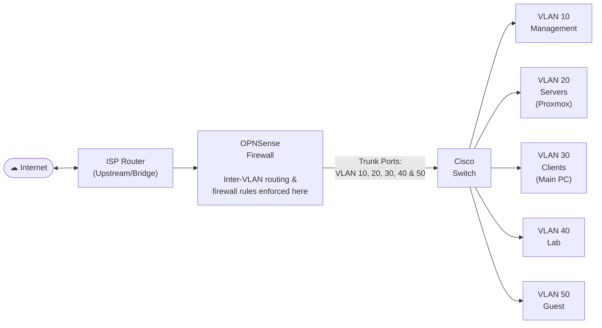

# Network Topology Diagram

```mermaid
graph LR
    Internet(["☁ Internet"])
    ISP["ISP Router\n(Upstream/Bridge)"]
    OPN["OPNSense\nFirewall\n\nInter-VLAN routing &\nfirewall rules enforced here"]
    SW["Cisco\nSwitch"]

    MGMT["VLAN 10\nManagement"]
    SRV["VLAN 20\nServers\n(Proxmox)"]
    CLT["VLAN 30\nClients\n(Main PC)"]
    LAB["VLAN 40\nLab"]
    GST["VLAN 50\nGuest"]

    Internet <--> ISP
    ISP --> OPN
    OPN -->|"Trunk Ports:\nVLAN 10, 20, 30, 40 & 50"| SW
    SW --> MGMT
    SW --> SRV
    SW --> CLT
    SW --> LAB
    SW --> GST
```
