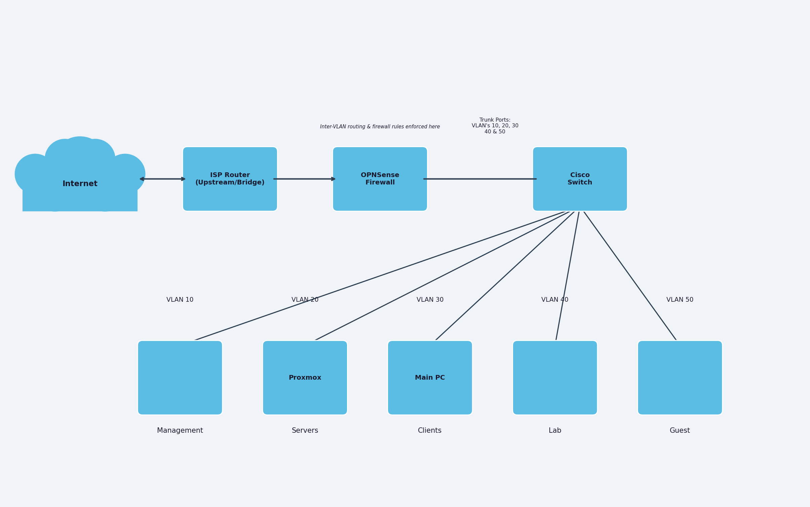

# home-lab-infrastructure
Home lab for learning enterprise IT: networking, Active Directory, security, and automation

## Overview
This project documents the design and implementation of a home lab environment built to simulate a small enterprise network.

The lab focuses on networking, Active Directory, security, and automation, with an emphasis on real-world architecture and troubleshooting.

---

## Objectives
- Develop skills required for 3rd line / infrastructure roles
- Gain hands-on experience with enterprise technologies
- Build a demonstrable portfolio of practical work

---

## Technologies Used
- OPNsense (Firewall & Routing)
- Cisco CBS350 (Managed Switch)
- Proxmox (Virtualisation)
- Windows Server (Active Directory, DNS, DHCP)
- PowerShell (Automation)

---

## Key Features
- VLAN-based network segmentation
- Inter-VLAN routing via firewall
- Role-based access control
- Centralised identity management (AD)
- Secure network design principles

---

## Current Status
- [ ] Firewall deployment
- [ ] VLAN configuration
- [ ] Active Directory setup
- [ ] Client integration
- [ ] Security monitoring (planned)

---

## Lab Architecture
Detailed design available in:
- [Network-Design/Network-Design.md](Network-Design/Network-Design.md)

